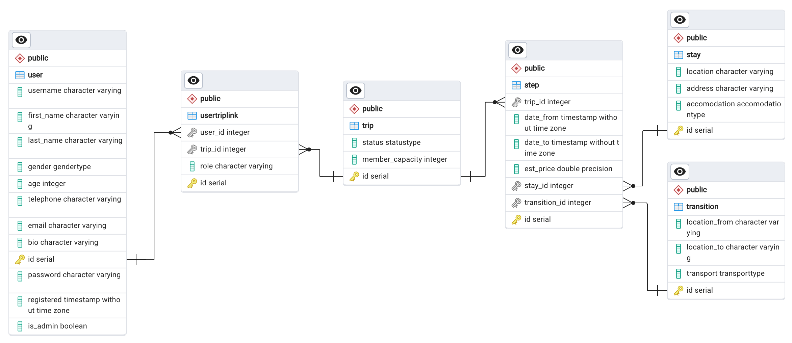

# ЛР 1. Реализация серверного приложения FastAPI.
# База данных

<br>

## Схема базы данных


<br>

## Скрипт подключения к БД

*connection.py*

```
from sqlmodel import SQLModel, Session, create_engine
import os
from dotenv import load_dotenv


load_dotenv()
db_url = os.getenv('DB_ADMIN')
engine = create_engine(db_url, echo=True)


def init_db():
    SQLModel.metadata.create_all(engine)


def get_session():
    with Session(engine) as session:
        yield session
```