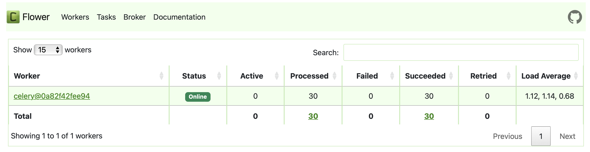

# ЛР 3. Упаковка FastAPI приложения в Docker. Работа с источниками данных. Очереди
# Задание 3

<br>

#### Вызов парсера из FastAPI через очередь

<br>

## Конфигурация Celery

Создадим отдельное celery-приложение и определим задачу для вызова парсера.

*LR1/endpoints/celery_tasks.py*
```
from celery import Celery

parser_url = os.getenv('PARSER_URL')
redis_url = os.getenv('REDIS_URL')


celery_app = Celery('tasks', broker=redis_url, backend=redis_url)


@celery_app.task()
def parse_celery(key: str):
    headers = {'accept': 'application/json'}
    data = {"key": key}
    response = requests.post(parser_url, headers=headers, params=data)
    time.sleep(5)
    return {"status": response.status_code, "response_msg": response.json()['message']}
```

<br>

## Асинхронный эндпойнт

Добавим еще один эндпойнт для асинхронного вызова парсера через очередь.

*LR1/endpoints/parser_endpoint.py*
```
from app.celery_tasks import parse_celery

# async parser call
@parse_router.post("/parse_async", tags=['Parser'], 
                   description='One of: "planes", "cruises", "trains", "airbnb", "hotels", "hostels"')
async def parse_data_async(key: str):
    result = parse_celery.delay(key)
    return {"message": "Parsing started", "task_id": result.id, "status": result.status}
```

<br>

## Оркестрация сервисов в docker-compose

Здесь представлена версия с дополнительными сервисами для реализации очереди.
*docker-compose.yml*
```
services:
  redis:
    image: redis
    ports:
      - 6379:6379
  celery_tasks:
    build: ./LR1
    command: celery -A app.celery_tasks worker --loglevel=info
    environment:
      - PARSER_URL=http://parser:8001/parse
      - REDIS_URL=redis://redis/0
    depends_on:
      - redis
      - main
      - celery_beat
  celery_beat:
    build: ./LR1
    command: celery -A app.celery_tasks beat --loglevel=info
    environment:
      - PARSER_URL=http://parser:8001/parse
      - REDIS_URL=redis://redis/0
    depends_on:
      - redis
      - main
  flower:
    build: ./LR1
    command: celery -A app.celery_tasks flower --port=5555
    environment:
      - PARSER_URL=http://parser:8001/parse
      - REDIS_URL=redis://redis/0
    ports:
      - 5555:5555
    depends_on:
      - redis
      - main
      - celery_tasks
  db:
    image: postgres
    volumes:
      - ./LR3/web_lab1.sql:/docker-entrypoint-initdb.d/web_lab1.sql
      - lab3_data:/var/lib/postgresql/data/
    environment:
      - POSTGRES_USER=admin
      - POSTGRES_PASSWORD=admin
      - POSTGRES_DB=lab3
      - PGDATA=/var/lib/postgresql/data/pgdata
    ports:
      - "5432:5432"
  main:
    build: ./LR1
    depends_on:
      - redis
      - db
    environment:
      - DB_ADMIN=postgresql://admin:admin@db/lab3
      - PARSER_URL=http://parser:8001/parse
      - REDIS_URL=redis://redis/0
    ports:
      - "8000:8000"
  parser:
    build: ./LR3
    depends_on:
      - db
    environment:
      - DB_ADMIN=postgresql://admin:admin@db/lab3
    ports:
      - "8001:8001"
volumes:
  lab3_data: 
```

<br>

## Проверка работы очереди

С помощью условного "клиента" проверим, как обрабатываются запросы.

*client.py*
```
import requests


def test_parse(key: str):
    endpoint = "http://127.0.0.1:8000/parse_async"
    headers = {'accept': 'application/json'}
    data = {"key": key}
    response = requests.post(endpoint, headers=headers, params=data)
    return response.json()


if __name__ == '__main__':
    keys = ["planes", "cruises", "trains", "airbnb", "hotels", "hostels"]
    for k in keys:
        print(test_parse(k))
```

Видим, как обработчик выполнил все задачи.


<br>

## Периодические задачи

Чтобы не тестить ручным клиентом, можем заставить приложение проверять самого себя.

Добавим в конфигурацию celery-приложения выполнение задачи парсинга каждые 20 секунд.

*LR1/endpoints/celery_tasks.py*
```
@celery_app.on_after_configure.connect
def setup_periodic_tasks(sender, **kwargs):
    key = random.choice(["planes", "cruises", "trains", "airbnb", "hotels", "hostels"])
    sender.add_periodic_task(20.0, parse_celery.s(key))
```

Добавим сервис в docker-compose. Beat с определенной периодичностью добавляет задачи в очередь, worker занимается их выполнением.

*docker-compose.yml*
```
services:
  ...
  celery_tasks:
    build: ./LR1
    command: celery -A app.celery_tasks worker --loglevel=info
    environment:
      - PARSER_URL=http://parser:8001/parse
      - REDIS_URL=redis://redis/0
    depends_on:
      - redis
      - main
      - celery_beat
  celery_beat:
    build: ./LR1
    command: celery -A app.celery_tasks beat --loglevel=info
    environment:
      - PARSER_URL=http://parser:8001/parse
      - REDIS_URL=redis://redis/0
    depends_on:
      - redis
      - main
  ...
```
Пока писала эту документацию, выполнилось 30 задач.
